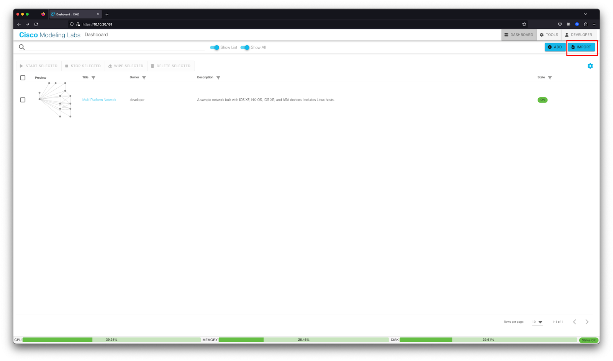
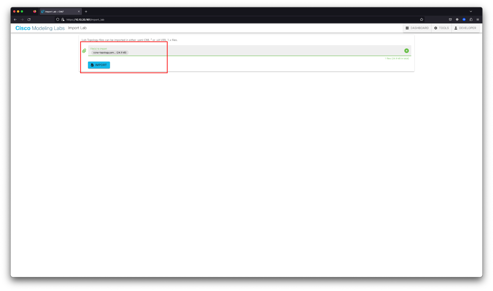
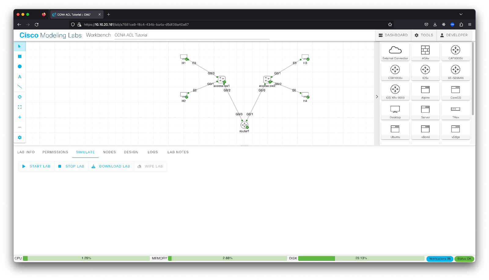

# CCNA: Configure Your First ACL

[Codelab Feedback](https://github.com/googlecodelabs/your-first-pwapp/issues)

## Overview

What You'll Learn

* Importing and starting your topology
* Access control list (ACL) overview
* Types of ACLs
* Applying the ACL to an interface
* Configuring your first ACL
* Testing your ACL

What You'll Need

* Access to a Cisco Modeling Labs system to run the provided topology:
* If you don't have access to a Cisco Modeling Labs server, you can reserve and use a  [DevNet Cisco Modeling Labs Sandbox](https://devnetsandbox.cisco.com/RM/Diagram/Index/5c964ff3-9d47-443a-90a9-971edf8fdb37).
* The ccna-topology.yaml network topology for Cisco Modeling Labs

## Importing and Starting the Lab Topology

Before we get into the details, you will need some networking devices to play with. The easiest way to do this is to use a Cisco Modeling Labs server. If you don't have access to a Cisco Modeling Labs server, you can reserve and use a  [DevNet Cisco Modeling Labs Sandbox](https://devnetsandbox.cisco.com/RM/Diagram/Index/5c964ff3-9d47-443a-90a9-971edf8fdb37). Assuming that you have access to a Cisco Modeling Labs server, you can import the ccna-topology.yaml file into your Cisco Modeling Labs server and start the lab.

* Log in to your Cisco Modeling Labs server web interface and click the IMPORT button.

* Browse to find the network topology ccna-topology.yaml file downloaded for this lab. Click IMPORT, and then click GO TO LAB.

* From the SIMULATE panel below the topology, click the START LAB button.

Note: Be sure that you do not have any switches in the topology selected, or you'll only start that one node.

* Wait for all nodes to get green check marks indicating that they are started. This process can take 1 to 5 minutes, depending on the Cisco Modeling Labs server's load.

## ACL Overview
Duration: 02:00

For those pursuing their CCNA certification, the concept of ACLs is essential to understand. ACLs are one of the security building blocks that network engineers use on a regular basis. Imagine a network that had no restrictions. Traffic could flow in any direction, bad actors could come and go as they please, and the network would be a mess. ACLs are one of the tools that network engineers use to control traffic flow and keep the network secure.

ACLs are used to filter traffic based on a set of rules. These rules can be based on source and destination IP addresses, source and destination ports, and other criteria. ACLs can be used to permit or deny traffic. Denying the traffic results in it getting dropped or put in the Bitbucket. ACLs are used on routers, switches, and firewalls.

Types of ACLs

There are two types of ACLs: standard and extended. Standard ACLs are used to filter traffic based on source IP address only. Extended ACLs are used to filter traffic based on source and destination IP addresses, source and destination ports, and other criteria. In most enterprise networks, extended ACLs are used more commonly because they have more things to customize.

Standard ACLs

Standard ACLs are used to filter traffic based on source IP address only. Standard ACLs are numbered 1 to 99 and 1300 to 1999. The number that you choose for the ACL is important because it determines the order in which the ACL is processed. The router starts from the top of the ACL first and then moves down the list until a matching statement is found. The packet being evaluated by the ACL is dropped when no match exists.

Defining an ACL on a Cisco IOS device does not change the behavior of the device until the ACL is applied, typically to an interface.

What does a  [standard ACL](https://www.cisco.com/c/en/us/support/docs/security/ios-firewall/23602-confaccesslists.html#anc38) look like? The syntax options are:

access-list access-list-number {permit|deny} {host|source source-wildcard|any}

For example, if you wanted to create an ACL that allowed traffic from the host **10.10.1.10**, you would use the following command:

access-list 10 permit host 10.10.1.10

If you wanted to create an ACL that allowed traffic from an entire subnet, you would need to add a wildcard mask. Going into detail about calculating wildcard masks is beyond the scope of this tutorial, but you can read more about them  [here](https://community.cisco.com/t5/networking-knowledge-base/access-control-lists-acl-explained/ta-p/4182349). For example, if you wanted to create an ACL that allowed traffic from the entire **10.10.5.X** /24 subnet you would use the following command:

access-list 10 permit 10.10.5.0 0.0.0.255

By default, there is an implicit deny all clause as a last statement with any ACL. That implicit clause will deny all traffic that is not explicitly permitted, meaning that you need to decide while drafting your ACLs if you want to implicitly deny all traffic or explicitly allow all traffic that does not fit the listed ACLs. If you want to explicitly allow all other traffic, you can add the following statement at the end of your ACL:

access-list 10 permit any

Extended ACLs

Extended ACLs on Cisco devices are used to filter traffic based on source and destination IP addresses, source and destination ports, and other criteria. Extended ACLs are numbered 100 to 199 and 2000 to 2699 or can also be named.

The general syntax structure of an extended ACL is:

access-list access-list-number {deny|permit} protocol source source-wildcard destination destination-wildcard

For example, you could create an ACL that permits all IP traffic from the source network **10.10.1.0/24** to the destination network **10.10.5.0/24** (using wildcard masks). The second line denies TCP traffic with source IP **10.10.1.0/24** and destination IP **10.10.5.0/24** on port 80 (HTTP). The last line permits all other IP traffic:

access-list 1 permit ip 10.10.1.0 0.0.0.255 10.10.5.0 0.0.0.255

access-list 1 deny tcp 10.10.1.0 0.0.0.255 eq 80 10.10.5.0 0.0.0.255

access-list 1 permit ip any any

You can also name an extended ACL, but this tutorial is just focusing on numbered ACL basics.

Applying the ACL to an Interface

After the ACL is created, it needs to be applied to an interface. The syntax for applying an ACL to an interface is:

interface type number

ip access-group {access-list-number | access-list-name} {in | out}

For example, if you wanted to apply the standard ACL **1** to the **GigabitEthernet 0/0** interface, you would use the following command:

interface GigabitEthernet 0/0

ip access-group 1 in

There is a lot more to understanding and mastering ACLs (especially practicing with wildcard masks), but this tutorial is designed to give you a basic understanding of how ACLs work and how to configure them. In the next topic, we will configure your first ACL.

## Configure Your First ACL
Duration: 02:00

In real-life networking scenarios, creating ACLs and updating them as the business changes is a common occurrence. Sometimes, you need to open up ports for a new development lab for the business, or you need to restrict access because of security concerns. Implementing the wrong ACL is a common cause of network outages, so learning how they operate and what they do is important. Playing around in the lab is the best place to learn how ACLs work, so let's get started.

Step 1: Defining Your Requirements

In a typical network engineering environment ACLs do not drop out of thin air. You need to discuss with your relevant stakeholders about what they are trying to accomplish and narrow it down to which source and IP addresses they want to work with and which ports are being used.

ACLs are also sometimes used to enable access to your own network devices and lock access to other potential bad actors. The example we are working with in this tutorial will follow that scenario. We will create an ACL that allows host **H1** to access the hosts in the other subnet (**H3** and **H4**) but deny access to the other hosts in the same subnet (**H2**). This approach could be for security reasons or because the other hosts are not allowed to access the other subnet for business reasons.

In your Cisco Modeling Labs topology, you have four hosts:

* **H1** with an IP address of **172.16.10.11**
* **H2** with an IP address of **172.16.10.21**
* **H3** with an IP address of **172.16.20.31**
* **H4** with an IP address of **172.16.20.41**

There are also two switches, one for each subnet; **access-sw1** handles the 172.16.10.0 /24 subnet (**H1** and **H2**), and **access-sw2** handles the 172.16.20.0 /24 subnet (**H3** and **H4**). The ACLs will be applied to the **router1** router.

Step 2: Verifying Connectivity

Before you start creating ACLs, you need to verify that you have connectivity between the hosts. This will help you verify that your ACLs are working as expected. Because our goal is to have **H1** be able to access **H3** and **H4**, we need to verify that **H1** can ping **H3** and **H4** before we start creating ACLs.

* Log in to **H1** and ping **H3** and **H4** to verify connectivity. You can do this by clicking the **H1** host icon in the topology and then clicking the Console button, and then Open Console. The login credentials will be **cisco** and **cisco** for all the devices in the topology.

To verify ping connectivity, you can issue the **ping** command with the IP address of the other hosts. For example, to ping **H3**, you would issue the following command:

ping 172.16.20.31

You are pinging from a Linux host for all our ping tests, so you will need to press CTRL + C to stop the ping (after a few seconds).

To ping **H4**, issue the following command:

ping 172.16.20.41

* Log in to **H2** and ping **H3** and **H4** to verify connectivity. You can do this by clicking the **H2** host icon in the topology and then clicking the Console button, and then Open Console.

To ping **H3**, issue the following command:

ping 172.16.20.31

Again, because you are pinging from a Linux host for all our ping tests, you will need to press CTRL + C to stop the ping (after a few seconds).

To ping **H4**, issue the following command:

ping 172.16.20.41

Note: We are not going to test connectivity from **H3** and **H4** to **H1** and **H2** because this tutorial is focused on ACLs (just on one side of the network) and not routing. We are assuming that the routing is already in place and working.

Step 3: Creating Your ACL

Now that you have verified connectivity, you can start creating your ACL. In this example, we are going to create a standard ACL that will allow **H1** to access **H3** and **H4** but deny access to **H2**. This will be accomplished by permitting access to **H1**; there is an implicit deny all at the end of the ACL, meaning that all other traffic will be denied (specifically **H2**).

* Log in to **router1** and enter global configuration mode. You can do this by clicking the **router1** icon in the topology and then clicking the Console button, and then Open Console.

First, enter enable mode and then configuration mode:

enable

conf t

Next, you will create your ACL. Because we are creating a standard ACL, we will use the **access-list** command with a number between 1 and 99. We will use **1** for this example. The syntax for the command is:

access-list 1 permit host 172.16.10.11

Because it is just a single host, we can use the **host** keyword before the IP address for **H1**. If we wanted to use a subnet, we would need to use a wildcard mask.

Next, we need to add the ACL to the interface. We will add it to the **Gig 0/0** interface. The syntax for the command is **ip access-group 1 in** because we are applying it to the inbound traffic on the interface and using **access-list 1**. Remember that standard ACLs are only based on source IP address, so we are not specifying a destination IP address.

The full commands are:

interface Gig 0/0

ip access-group 1 in

end

Step 4: Testing Your ACL

Now that you have created your ACL, you need to test it. You can do this by logging back in to **H1** and **H2** and trying to ping **H3** and **H4** again.

* Log in to **H1** and ping **H3** and **H4** to verify connectivity. You can do this by clicking the **H1** host icon in the topology and then clicking the Console button, and then Open Console.

To ping **H3**, issue the following command:

ping 172.16.20.31

Because you are pinging from a Linux host for all our ping tests, you will need to press CTRL + C to stop the ping (after a few seconds).

To ping **H4**, issue the following command:

ping 172.16.20.41

The pings should be successful because we are allowing **H1** to access **H3** and **H4** and denying all other traffic.

* Log in to **H2** and ping **H3** and **H4** to verify connectivity. You can do this by clicking the **H2** host icon in the topology and then clicking the Console button, and then Open Console.

ping 172.16.20.31

Because you are pinging from a Linux host for all our ping tests, you will need to press CTRL + C to stop the ping (after a few seconds).

To ping **H4**, issue the following command:

ping 172.16.20.41

The pings should fail because we are denying **H2** access to **H3** and **H4** and denying all other traffic ().

Your output should look similar to the following:

H2:~$ ping 172.16.20.41

PING 172.16.20.41 (172.16.20.41): 56 data bytes

64 bytes from 172.16.20.41: seq=0 ttl=42 time=8.567 ms

64 bytes from 172.16.20.41: seq=1 ttl=42 time=3.262 ms

^C

--- 172.16.20.41 ping statistics ---

2 packets transmitted, 2 packets received, 0% packet loss

round-trip min/avg/max = 3.262/5.914/8.567 ms

H2:~$

H2:~$

H2:~$

H2:~$

H2:~$ ping 172.16.20.41

PING 172.16.20.41 (172.16.20.41): 56 data bytes

^C

--- 172.16.20.41 ping statistics ---

2 packets transmitted, 0 packets received, 100% packet loss

H2:~$

Notice that the first ping showed **0% packet loss** and the second ping showed **100% packet loss**; this is because the first ping was successful and the second was denied.

## Congratulations

Congrats! Please continue your learning through our community's many other resources, helping folks get started in their CCNA journey.

Training Resources

*  [CCNA E-Learning](https://learningnetworkstore.cisco.com/on-demand-e-learning/implementing-and-administering-cisco-solutions-ccna-v1.0/ELT-CCNA-V1-023587.html)
*  [CCNA Study Materials](https://learningnetwork.cisco.com/s/learning-plan-detail-standard?ltui__urlRecordId=a1c3i0000005hsQAAQ&ltui__urlRedirect=learning-plan-detail-standard)
*  [CCNA Exam Topics](https://learningnetwork.cisco.com/s/ccna-exam-topics)

Learn More

*  [Cisco Learning Network](https://learningnetwork.cisco.com/s/)
*  [Cisco Learning Network CCNA Certification Community](https://learningnetwork.cisco.com/s/topic/0TO3i0000008jYHGAY/ccna-certification-community)

