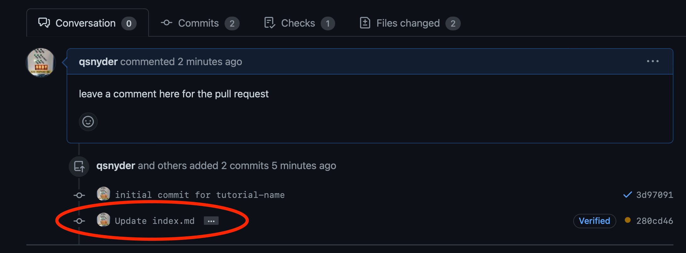

<!-- MANDATORY STEP: Overview Step is a required step and must be at the beginning of each codelab -->


### What You’ll Learn
- The proper steps to follow to clone the tutorial code
- Creating new branches within VSCode
- How to use VSCode to edit your code
- Using VSCode to publish new tutorial branches
- Synching outside changes within VSCode

### What You'll Need
- Microsoft VSCode installed on your platform of choice

> Note: This tutorial is written for those who are unfamiliar with the use of git-driven publishing operations and are looking for a stepwise process to write tutorials.  This tutorial will serve as the "standard" way to work with the git-ops process and while other ways exist to perform the same steps, any troubleshooting of the process followed will not be possible by the L&C Technical Advocacy team unless these steps are followed.





1. Once you have been given access to the repository by an L&C Technical Advocate, navigate to https://github.com/CiscoLearning/cisco-learning-codelabs.  The repository should look as in the screenshot below

2. Click on the **Code** button towards the middle of the window.  Click the **Copy** button to the right of the URL.  This will copy the URL location to your cliboard

3. Open up a terminal and navigate to the location in which you want the folder to be downloaded.  In the example below, I created a folder in `~/temp`, but usually put working code in `~/dev` or `~/src`.  Once the folder is created, change into that directory and type `git clone`, followed by a space and then use your OS's "paste" functionality to place the URL on the terminal.  Alternatively, you could type `git clone https://github.com/CiscoLearning/cisco-learning-codelabs.git`

4. Finally, open the Microsoft VSCode application.  Click on the **Open Folder** button, then navigate to the location that you cloned the folder.

5. You should now see the following folder structure in your VSCode window





1. Once the folder has been opened, ensure that you're in the `main` branch of the repository.  This can be seen by looking at the lower left of the VSCode window.

2. To create a new branch, start by clicking on the `main` icon, which will pop out a menu at the top center of the VSCode window.  Select the **Create new branch from...** menu item

3. Once you click on the **Create new branch from...** item, the menu will change to all of the available branches from which to create the new branch (this may look different than the screenshot based on what branches are local to your system or which are available on the remote).  In this window, *always* select **origin/main** with a preceeding cloud (as highlighted in the screenshot).  This will create a new branch from the current set of items that are present in the `main` branch that resides online.

4. After selecting the location to create a new branch from, the menu will change to allow you to enter a name for the branch.  The branch should reflect (and ideally, mimic) the short-name of the tutorial that you wish to create.  The name should be short, hyphenated as needed, and preferably done in all lower case.

5. The new branch name should now be reflected in the lower left corner of the VSCode window (replacing the `main` previously seen above).





1. Once you are in the correct branch, we need to scaffold the folder structure for the new tutorial.  This is done by using the `create_new_lab.sh` script.  To execute this, we need to invoke the script from a terminal, which can be found inside of the VSCode window.  To bring up a terminal, move your mouse to the bottom of the window, just above the status bar.  An arrow pointing "up" and a blue line should appear.  Click and drag up, and a terminal window will appear.  It may look different from the colors below, depending on your editor theme).

2. Execute the `create_new_lab.sh` script by typing `./create_new_lab.sh` in the terminal window and press `<RETURN>`.  Follow the prompts on screen to provide a tutorial name (ideally the same as the branch name you used in previous steps).  This will perform some basic linting, and then provide the path of the new directory that you can use to begin working on your tutorial.

3. Navigate to your newly created directory for the tutorial in the left pane of the editor.  The new directory will be created under `site/content/posts/<tutorial-name>`

4. The file that you'll be editing in markdown is the `index.md` contained within the folder for your tutorial that was created in the previous step.  If you select this file to bring it into the editor, you can preview the file by clicking on the two column icon with a magnifying glass.   This will bring up a split pane view allowing you to preview the file as you edit it.





1. Once you have the tutorial created, it is time to publish the branch to Github so that it can be reviewed, both technically and for grammar and editorial content.  Start by selecting the "Source Control" button on the leftmost side of the VSCode window.  It is generally the third icon down, and may look different from the icon in the screenshot below.  However, if you hold your mouse cursor over the icon, it will indicate it is source control.

2. You will then see a view similar to the one below.  For `git` to track and commit files, they need to be added to the stage.  Click the **+** icon next to each of the changed files to add them to "Staged Changes".  Then add in a short commit message in the box at the top of the pane.  Once these two items are complete, press the **Commit** button.

3. Now that the changes are commited, we can push the changes to the remote server (remember, `git` can function locally without any remote server).  Once the changes have been committed locally, the **Commit** button from the previous step will change to **Publish Branch**.  By clicking this button, you will publish your local tutorial branch to the Github server under that same branch name.

4. Once the changes have been published to the remote, log back in to the Github repository online.  At the top of the file listing, you should see a message similar to the one below, where a feature branch has had a recent push and it prompts you to perform **Compare & Pull Request**.  Click on the **Compare & Pull Request** button.

5. You will be taken to a new page, where you can provide a title for the PR, as well as any comments for the reviewing teams.  When you have these items filled in, click on **Create pull request**





1. During the editing process, the editorial review or the TA team may require you to add in additional information.  These teams may provide edits in addition to the request, which are also tracked through the Github PR.  If you are tagged or contacted to provide additional edits or information, but see changes made after your commit (as shown in the circled region of the screenshot below), you may need to synch the changes from Github to your local system before changes can be made.

2. To synch these changes, return to VSCode and ensure that you are in your feature branch created earlier.  Click on the **Source Control** icon on the far left.  You should see that VSCode has detected changes and that the remote (Github.com) has commits applied to it that your local branch does not have.  Therefore, it will display a **Sync Changes** button in green, along with the number of changes that it will sync in each direction (the screenshot below displays a single change to be pulled down, which aligns with the change history we saw in the PR above).  Click the **Sync Changes** button.

3. Once the changes have been made to your repository, the green button will be dimmed and you will see the changes reflected in the document (compare the screenshot below with the one directly above).  You can now proceed to make the required changes to the file as requested.

4. When you have made the required or desired changes, return to the **Source Control** side pane, stage the changed files, provide a commit message, and then click on the **Commit** button.

5. Once the commit is complete, you will still need to synchronize the changes with the remote (Github.com).  Press the green **Sync Changes** button to ensure that these changes are pushed to the remote.

6. This sync action will bring a popup window indicating that you will be pushing and pulling from the remote to sync the changes.  Simply click OK.

7. Finally, if you return to the Github repository and click on the PR, you will see that the new commit has been added to the change history below any edits that may have been made.  This validates that your changes have now been added to your tutorial and we can continue the review process.  This process may repeat several times until we indicate that your tutorial is ready to be published, at which point we will close the PR and merge this tutorial into the `main` branch.



<!-- MANDATORY STEP: Call to Action Step is a required step and must be at the end of each codelab -->


Congratulations.  You've published your tutorial and learned how to use the `git` workflow within VSCode.  If you have any questions, reach out to a member of the Learning and Certifications Technical Advocacy team.


