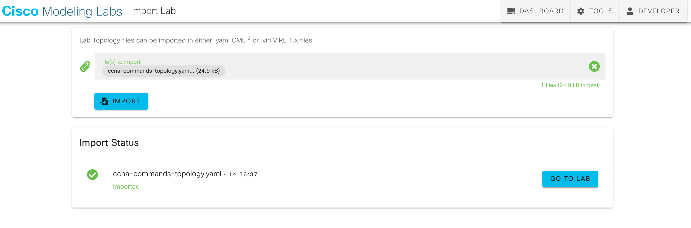
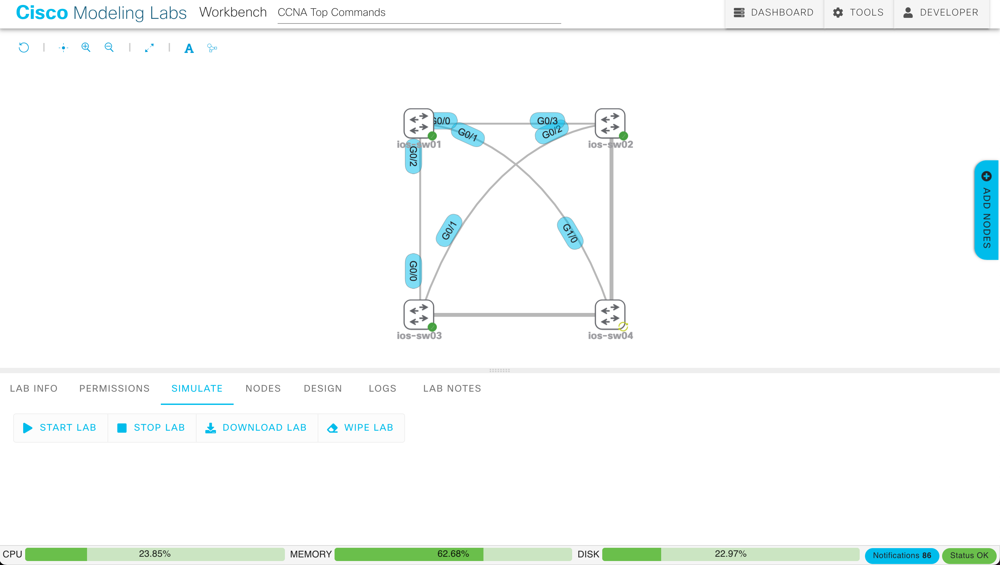
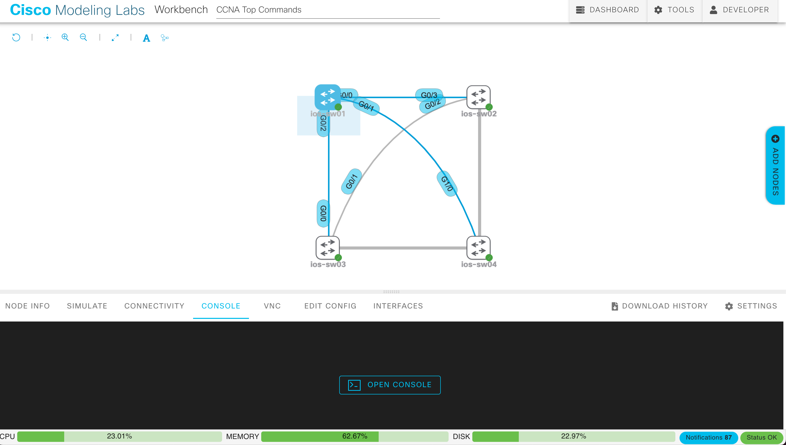
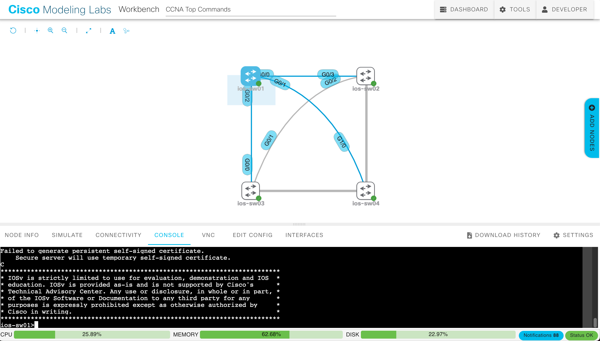

<!-- MANDATORY STEP: Overview Step is a required step and must be at the beginning of each codelab -->


### What You’ll Learn
- `show interfaces` command
- `show ip interface brief` and `show version` commands
- `show running-config` command

### What You'll Need
- Access to a Cisco Modeling Labs (CML) system to run the provided topology
  - If you don't have access to a Cisco Modeling Labs server, you can reserve and use a [DevNet Cisco Modeling Labs Enterprise Sandbox](https://devnetsandbox.cisco.com/RM/Diagram/Index/45100600-b413-4471-b28e-b014eb824555?diagramType=Topology)
- The [ccna-commands-topology](ccna-commands-topology.yaml) network topology for Cisco Modeling Labs



<!-- When defining steps, Make sure there is no spaces between the brackets { {< >} } -->


**Note** If you don't have access to a Cisco Modeling Labs server, you can reserve and use a [DevNet Cisco Modeling Labs Enterprise Sandbox](https://devnetsandbox.cisco.com/RM/Diagram/Index/45100600-b413-4471-b28e-b014eb824555?diagramType=Topology). You can download the network topology file here: [ccna-commands-topology](ccna-commands-topology.yaml) for Cisco Modeling Labs.

1. Log in to your Cisco Modeling Labs server web interface and click the **IMPORT** button.


2. Browse to find the network topology `ccna-commands-topology.yaml` file downloaded for this lab. **IMPORT** it into the system, and then click **GO TO LAB**.



3. From the **SIMULATE** panel below the topology, click the **START LAB** button.

Note: Be sure that you do not have any switches in the topology selected or you'll only start that one node.



4. Wait for all nodes to get green check marks indicating they are started. This process can take 1 to 5 minutes, depending on the Cisco Modeling Labs server's load.







We will be entering commands into the console for network devices and nodes throughout this lab. Follow these steps to access the console for any node in the topology.

1. Select the node whose console you need to interact with. From the **CONSOLE** panel below the topology, click the **OPEN CONSOLE** button.



2. Click within the console window and press **Enter** to activate the terminal and begin interacting with the console.



3. Type commands into the window, or copy and paste into the terminal.






The `show interfaces` command is super helpful to give detailed information on all your interfaces. You can use it both to get a quick view of the MAC and IP addresses of your interfaces and to troubleshoot by looking at errors on a particular interface.

1. Start with `ios-sw01`. Open the console and enter `enable` mode. Type `show interfaces ?` to see the available options:

```
ios-sw01>enable
ios-sw01#
ios-sw01#show interfaces ?
  Async              Async interface
  Auto-Template      Auto-Template interface
  BVI                Bridge-Group Virtual Interface
  Bluetooth          Bluetooth interface
  CTunnel            CTunnel interface
  Dialer             Dialer interface
  EsconPhy           ESCON interface
  Filter             Filter interface
  Filtergroup        Filter Group interface
  GMPLS              MPLS interface
  GigabitEthernet    GigabitEthernet IEEE 802.3z
  GroupVI            Group Virtual interface
  LISP               Locator/ID Separation Protocol Virtual Interface
  Loopback           Loopback interface
  Lspvif             LSP virtual interface
  MFR                Multilink Frame Relay bundle interface
  Multilink          Multilink-group interface
  Null               Null interface
  Port-channel       Ethernet Channel of interfaces
  Portgroup          Portgroup interface
  Pos-channel        POS Channel of interfaces
  SYSCLOCK           Telecom-Bus Clock Controller
  Tunnel             Tunnel interface
  Vif                PGM Multicast Host interface
  Virtual-Template   Virtual Template interface
  Virtual-TokenRing  Virtual TokenRing
  Vlan               Catalyst Vlans
  accounting         Show interface accounting
  capabilities       Show interface capabilities information
  counters           Show interface counters
  crb                Show interface routing/bridging info
  dampening          Show interface dampening info
  debounce           Show interface debounce time info
  description        Show interface description
  etherchannel       Show interface etherchannel information
  fair-queue         Show interface Weighted Fair Queueing (WFQ) info
  fcpa               Fiber Channel
  flowcontrol        Show interface flowcontrol information
  history            Show interface history
  irb                Show interface routing/bridging info
  mac-accounting     Show interface MAC accounting info
  mpls-exp           Show interface MPLS experimental accounting info
  mtu                Show interface mtu
  precedence         Show interface precedence accounting info
  private-vlan       Show interface private vlan information
  pruning            Show interface trunk VTP pruning information
  random-detect      Show interface Weighted Random Early Detection (WRED) info
  rate-limit         Show interface rate-limit info
  stats              Show interface packets & octets, in & out, by switching
                     path
  status             Show interface line status
  summary            Show interface summary
  switchport         Show interface switchport information
  trunk              Show interface trunk information
  voaBypassIn        VOA-Bypass-In interface
  voaBypassOut       VOA-Bypass-Out interface
  voaFilterIn        VOA-Filter-In interface
  voaFilterOut       VOA-Filter-Out interface
  voaIn              VOA-In interface
  voaOut             VOA-Out interface
  |                  Output modifiers
  cr

```

Note that you can either provide an argument that begins with the interface type (such as `GigabitEthernet` from the topology) or simply press Enter and see all the interfaces.

2. Press Enter and then press the space bar to review the output of all the interfaces (the following output is truncated to just the first two interfaces):

```
ios-sw01#show interfaces
GigabitEthernet0/0 is up, line protocol is up (connected)
  Hardware is iGbE, address is 5254.000a.1a9c (bia 5254.000a.1a9c)
  Description: Link to ios-sw02
  MTU 1500 bytes, BW 1000000 Kbit/sec, DLY 10 usec,
     reliability 255/255, txload 1/255, rxload 1/255
  Encapsulation ARPA, loopback not set
  Keepalive set (10 sec)
  Auto Duplex, Auto Speed, link type is auto, media type is RJ45
  output flow-control is unsupported, input flow-control is unsupported
  ARP type: ARPA, ARP Timeout 04:00:00
  Last input 00:00:00, output 00:00:12, output hang never
  Last clearing of "show interface" counters never
  Input queue: 0/75/0/0 (size/max/drops/flushes); Total output drops: 0
  Queueing strategy: fifo
  Output queue: 0/0 (size/max)
  5 minute input rate 0 bits/sec, 0 packets/sec
  5 minute output rate 0 bits/sec, 0 packets/sec
     2976 packets input, 224602 bytes, 0 no buffer
     Received 2972 broadcasts (2972 multicasts)
     0 runts, 0 giants, 0 throttles
     0 input errors, 0 CRC, 0 frame, 0 overrun, 0 ignored
     0 watchdog, 2972 multicast, 0 pause input
     157 packets output, 33752 bytes, 0 underruns
     0 output errors, 0 collisions, 2 interface resets
     0 unknown protocol drops
     0 babbles, 0 late collision, 0 deferred
     0 lost carrier, 0 no carrier, 0 pause output
     0 output buffer failures, 0 output buffers swapped out
GigabitEthernet0/1 is up, line protocol is up (connected)
  Hardware is iGbE, address is 5254.0016.1773 (bia 5254.0016.1773)
  Description: Link to ios-sw04
  MTU 1500 bytes, BW 1000000 Kbit/sec, DLY 10 usec,
     reliability 255/255, txload 1/255, rxload 1/255
  Encapsulation ARPA, loopback not set
  Keepalive set (10 sec)
  Auto Duplex, Auto Speed, link type is auto, media type is RJ45
  output flow-control is unsupported, input flow-control is unsupported
  ARP type: ARPA, ARP Timeout 04:00:00
  Last input 00:00:00, output 00:00:15, output hang never
  Last clearing of "show interface" counters never
  Input queue: 0/75/0/0 (size/max/drops/flushes); Total output drops: 0
  Queueing strategy: fifo
  Output queue: 0/0 (size/max)
  5 minute input rate 0 bits/sec, 0 packets/sec
  5 minute output rate 0 bits/sec, 0 packets/sec
     2892 packets input, 218659 bytes, 0 no buffer
--More--
```

There are a few helpful things to note:

- The first line for each interface output, `GigabitEthernet0/0 is up, line protocol is up (connected)`, first has the hardware status and then the line protocol. The hardware status is the status of the OSI physical layer, and the line protocol is the status of the OSI data link layer. Together, the two are the status of the TCP/IP link layer. In this example, the entire link layer is active and ready; in other words, the interface can send and receive frames. This state is referred to as “up/up.” Note that if the hardware is down, the line protocol will also be down.
- Check out under Gig 0/0 the portion that says `(bia 5254.000a.1a9c)`, which gives you the "burned-in MAC address" for that interface. Knowing the BIA MAC can be helpful in troubleshooting because the MAC addresses that are not BIA can change.
- Farther down `Auto Duplex, Auto Speed, link type is auto, media type is RJ45`, it shows the type and mode of connection, letting us know it is full duplex and not half duplex.
- `5 minute input rate 0 bits/sec, 0 packets/sec` reports interface traffic statistics for the average input rate. In this case, it happens to be 0 because the lab just started.

Try the command again, but just for one interface this time, using the `show interfaces gig 0/0` command. Note that I used the shorthand of `gig` instead of `GigabitEthernet` and the CLI understood what I meant. If the interface traffic stats were 0 for you like they were for mine, by now, they should have some traffic data (`5 minute input rate 1000 bits/sec, 1 packets/sec`):

```
ios-sw01#show interfaces gig 0/0
GigabitEthernet0/0 is up, line protocol is up (connected)
  Hardware is iGbE, address is 5254.000a.1a9c (bia 5254.000a.1a9c)
  Description: Link to ios-sw02
  MTU 1500 bytes, BW 1000000 Kbit/sec, DLY 10 usec,
     reliability 255/255, txload 1/255, rxload 1/255
  Encapsulation ARPA, loopback not set
  Keepalive set (10 sec)
  Auto Duplex, Auto Speed, link type is auto, media type is RJ45
  output flow-control is unsupported, input flow-control is unsupported
  ARP type: ARPA, ARP Timeout 04:00:00
  Last input 00:00:00, output 00:00:09, output hang never
  Last clearing of "show interface" counters never
  Input queue: 0/75/0/0 (size/max/drops/flushes); Total output drops: 0
  Queueing strategy: fifo
  Output queue: 0/0 (size/max)
  5 minute input rate 1000 bits/sec, 1 packets/sec
  5 minute output rate 0 bits/sec, 0 packets/sec
     4498 packets input, 338179 bytes, 0 no buffer
     Received 4495 broadcasts (4495 multicasts)
     0 runts, 0 giants, 0 throttles
     0 input errors, 0 CRC, 0 frame, 0 overrun, 0 ignored
     0 watchdog, 4495 multicast, 0 pause input
     219 packets output, 48337 bytes, 0 underruns
     0 output errors, 0 collisions, 2 interface resets
     0 unknown protocol drops
     0 babbles, 0 late collision, 0 deferred
     0 lost carrier, 0 no carrier, 0 pause output
     0 output buffer failures, 0 output buffers swapped out
ios-sw01#
```





Sometimes, you need a bird's eye view on your interfaces but don't need to get into all the details of a `show interfaces`. This is especially true if you have a lot of physical and virtual interfaces; the output can get really long. The `show ip interface brief` command is good to use to get that high-level view of your interfaces and their statuses. A helpful memory tool for me to remember the command is based on the shortened style of the command; `sh ip br` in my mind is "ship brief" and is easier to remember.

## show ip interface brief

To see the command output, issue the `show ip interface brief` command in the console for `ios-sw01`.

```
ios-sw01#show ip interface brief
Interface              IP-Address      OK? Method Status                Protocol
GigabitEthernet0/0     unassigned      YES unset  up                    up
GigabitEthernet0/1     unassigned      YES unset  up                    up
GigabitEthernet0/2     unassigned      YES unset  up                    up
GigabitEthernet0/3     unassigned      YES unset  up                    up
GigabitEthernet1/0     unassigned      YES unset  up                    up
GigabitEthernet1/1     unassigned      YES unset  up                    up
GigabitEthernet1/2     unassigned      YES unset  up                    up
GigabitEthernet1/3     unassigned      YES unset  up                    up
Vlan75                 172.16.34.1     YES TFTP   up                    up
ios-sw01#
```

The output is very cleanly formatted into tables, where you can at a glance see which interfaces are up and which are down, and if they have IP addresses assigned, including any SVI Layer 3 interfaces like `interface Vlan75`. The downside of this view is that you will not see details like drops or CRC errors that cause performance issues but are not causing the link to go down. Going back to the `show interfaces` command would give you details like that.

## show version

Next, the `show version` command is very frequently used to not only view the Cisco IOS version but also get data like the uptime of the device, the config register, and other details, depending on the platform. (This virtual version of Cisco IOS does not have it, but you can often also get the serial number and BIA MAC of the device.)

```
ios-sw01#show version
Cisco IOS Software, vios_l2 Software (vios_l2-ADVENTERPRISEK9-M), Experimental Version 15.2(20200924:215240) [sweickge-sep24-2020-l2iol-release 135]
Copyright (c) 1986-2020 by Cisco Systems, Inc.
Compiled Tue 29-Sep-20 11:53 by sweickge


ROM: Bootstrap program is IOSv

ios-sw01 uptime is 49 minutes
System returned to ROM by reload
System image file is "flash0:/vios_l2-adventerprisek9-m"
Last reload reason: Unknown reason


This product contains cryptographic features and is subject to United
States and local country laws governing import, export, transfer and
use. Delivery of Cisco cryptographic products does not imply
third-party authority to import, export, distribute or use encryption.
Importers, exporters, distributors and users are responsible for
compliance with U.S. and local country laws. By using this product you
agree to comply with applicable laws and regulations. If you are unable
to comply with U.S. and local laws, return this product immediately.

A summary of U.S. laws governing Cisco cryptographic products may be found at:
http://www.cisco.com/wwl/export/crypto/tool/stqrg.html

If you require further assistance please contact us by sending email to
export@cisco.com.

Cisco IOSv () processor (revision 1.0) with 672993K/111616K bytes of memory.
Processor board ID 971W0OU72ST
1 Virtual Ethernet interface
8 Gigabit Ethernet interfaces
DRAM configuration is 72 bits wide with parity disabled.
256K bytes of non-volatile configuration memory.
0K bytes of ATA System CompactFlash 0 (Read/Write)
0K bytes of ATA CompactFlash 1 (Read/Write)
11217K bytes of ATA CompactFlash 2 (Read/Write)
0K bytes of ATA CompactFlash 3 (Read/Write)

Configuration register is 0x101

ios-sw01#
```






One of the most important show commands is `show running-config`. Even though it does not give you any operational data, it will give you all the lines of configuration that are running on your network device. You can ignore the lines that begin with `!` because that means those lines are commented out and are not lines of configuration.

Issue a `show running-config` on `ios-sw01` and press the space bar key to view the configuration:

```
ios-sw01#show running-config
Building configuration...

Current configuration : 3920 bytes
!
! Last configuration change at 22:37:47 UTC Mon Dec 5 2022
!
version 15.2
service timestamps debug datetime msec
service timestamps log datetime msec
no service password-encryption
service compress-config
!
hostname ios-sw01
!
boot-start-marker
boot-end-marker
!
!
no logging console
!
no aaa new-model
!
!
!
 --More--
```

Oftentimes, production devices can have very long configuration files. There are some useful shortcuts that you can use.

2. If you are looking for a specific line, you can use the `| include` phrase after your command. Check the VTP config by modifying your command using `show running-config | include vtp`:

```
ios-sw01#show run | include vtp
vtp mode transparent
ios-sw01#
```

Note that I also shortened the command to simply `show run` as a shorthand for `show running-config`.

3. Sometimes, you are only interested in a certain portion of the config but want more than one line. You can view a whole section by adding `| section`. Check the interface config by issuing the `show run | section interface` command:

```
ios-sw01#show run | section interface
interface GigabitEthernet0/0
 description Link to ios-sw02
 switchport trunk allowed vlan 75,125,135,150
 switchport trunk encapsulation dot1q
 switchport trunk native vlan 10
 switchport mode trunk
 negotiation auto
interface GigabitEthernet0/1
 description Link to ios-sw04
 switchport trunk allowed vlan 75,125,135,150
 switchport trunk encapsulation dot1q
 switchport trunk native vlan 10
 switchport mode trunk
 negotiation auto
interface GigabitEthernet0/2
 description Link to ios-sw03
 switchport trunk allowed vlan 75,125,135,150
 switchport trunk encapsulation dot1q
 switchport trunk native vlan 10
 switchport mode trunk
 negotiation auto
interface GigabitEthernet0/3
 negotiation auto
interface GigabitEthernet1/0
 negotiation auto
interface GigabitEthernet1/1
 description Desktop
 switchport access vlan 125
 switchport mode access
 negotiation auto
interface GigabitEthernet1/2
 description Desktop
 switchport access vlan 125
 switchport mode access
 negotiation auto
interface GigabitEthernet1/3
 description Desktop
 switchport access vlan 125
 switchport mode access
 negotiation auto
interface Vlan75
 ip address 172.16.34.1 255.255.255.0
ios-sw01#
```

4. One final trick is if you know you want to start at a certain line, but it is not necessarily a section. You can add `| begin` to a command to start scrolling at a certain line in the configuration. Issue the command `show run | begin aaa` to start at the AAA config, and you can keep scrolling past there.

```

ios-sw01#show run | begin aaa
no aaa new-model
!
!
!
!
!
vtp mode transparent
!
!
!
ip cef
no ipv6 cef
!
!
!
spanning-tree mode pvst
spanning-tree extend system-id
!
!
vlan 10
 name Native VLAN
!
vlan 75
 --More--
```




<!-- MANDATORY STEP: Call to Action Step is a required step and must be at the end of each codelab -->


Congrats! Please continue your learning through our community's many other resources, helping folks get started in their CCNA journey.

## Training Resources

- [CCNA E-Learning](https://learningnetworkstore.cisco.com/on-demand-e-learning/implementing-and-administering-cisco-solutions-ccna-v1.0/ELT-CCNA-V1-023587.html?utm_campaign=tofu&utm_source=web-github&utm_medium=ccna-top-commands)
- [CCNA Study Materials](https://learningnetwork.cisco.com/s/learning-plan-detail-standard?ltui__urlRecordId=a1c3i0000005hsQAAQ&ltui__urlRedirect=learning-plan-detail-standard?utm_campaign=tofu&utm_source=web-github&utm_medium=ccna-top-commands)
- [CCNA Exam Topics](https://learningnetwork.cisco.com/s/ccna-exam-topics?utm_campaign=tofu&utm_source=web-github&utm_medium=ccna-top-commands)

## Learn More

- [Cisco Learning Network](https://learningnetwork.cisco.com/s/?utm_campaign=tofu&utm_source=web-github&utm_medium=ccna-top-commands)
- [Cisco Learning Network CCNA Certification Community](https://learningnetwork.cisco.com/s/topic/0TO3i0000008jYHGAY/ccna-certification-community?utm_campaign=tofu&utm_source=web-github&utm_medium=ccna-top-commands)


